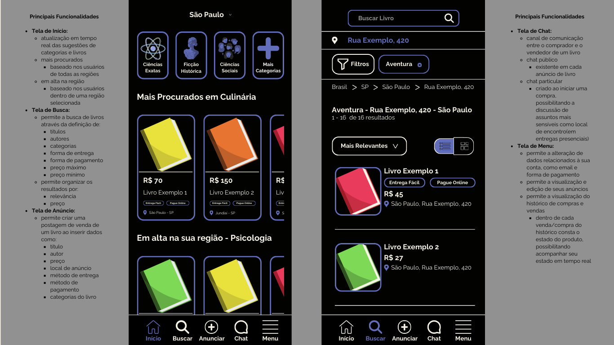
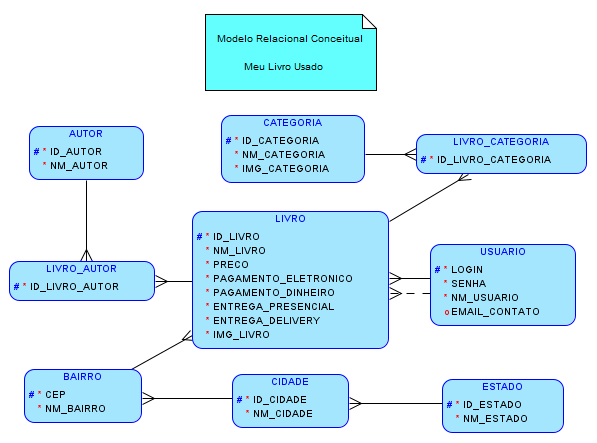
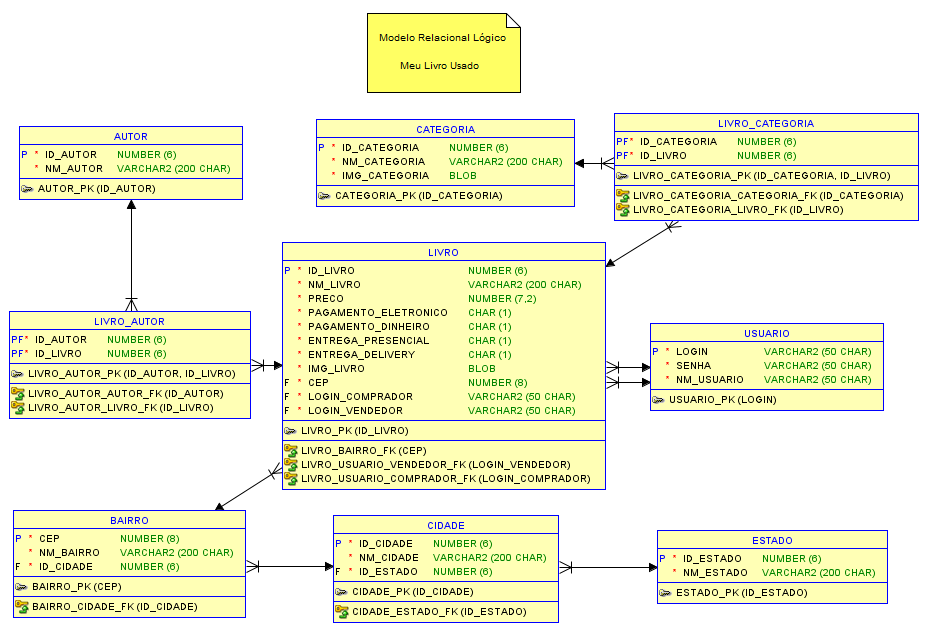

# Meu Livro Usado

## Design do FrontEnd
- Tela de Início

- Navegação pelo app


## Design do BackEnd
- Modelo Relacional Conceitual

- Modelo Relacional Conceitual


## Estrutura do Projeto

```
projeto/
│
├── app.py              # Aplicação principal Flask
├── requirements.txt    # Dependências Python
├── schema.sql          # Script de criação do banco de dados
├── config
│   └── config.py       # Configurações do projeto
├── assets
│   ├── frontend1.png   # Primeira imagem do UI e UX do projeto
│   ├── frontend2.png   # Segunda imagem do UI e UX do projeto
│   ├── Conceitual.png  # Imagem do Modelo Relacional Conceitual do Projeto
│   └── Logico.png      # Imagem do Modelo Relacional Lógico do Projeto
├── templates
└── test
    └── test_api.py     # Script de teste da API
```

## Instalação e Configuração

### 1. Criar/Ativar ambiente virtual (caso necessário)

```bash
# Criar ambiente python tipo venv
python -m venv venv

# Ativação no Windows
    # Ativa scripts locais
Set-ExecutionPolicy -Scope CurrentUser -ExecutionPolicy RemoteSigned
    # Ativa ambiente
venv\Scripts\activate

# Ativação no Linux/Mac
source venv/bin/activate
```

### 2. Instalar dependências

```bash
pip install -r requirements.txt
```

### 3. Executar a aplicação

```bash
python app.py
```

A API será executada em `http://localhost:5000`

## Endpoints da API

### Estados
- `GET /estados` - Lista todos os estados
- `GET /estados/{id}` - Busca estado por ID
- `POST /estados` - Cria novo estado
- `PUT /estados/{id}` - Atualiza estado
- `DELETE /estados/{id}` - Remove estado

**Exemplo POST:**
```json
{
    "nm_estado": "São Paulo"
}
```

### Cidades
- `GET /cidades` - Lista todas as cidades (com nome do estado)
- `GET /cidades/{id}` - Busca cidade por ID
- `POST /cidades` - Cria nova cidade
- `PUT /cidades/{id}` - Atualiza cidade
- `DELETE /cidades/{id}` - Remove cidade

**Exemplo POST:**
```json
{
    "nm_cidade": "São Paulo",
    "id_estado": 1
}
```

### Bairros
- `GET /bairros` - Lista todos os bairros (com cidade e estado)
- `GET /bairros/{cep}` - Busca bairro por CEP
- `POST /bairros` - Cria novo bairro
- `PUT /bairros/{cep}` - Atualiza bairro
- `DELETE /bairros/{cep}` - Remove bairro

**Exemplo POST:**
```json
{
    "cep": 1310100,
    "nm_bairro": "Centro",
    "id_cidade": 1
}
```

### Usuários
- `GET /usuarios` - Lista todos os usuários (sem senha)
- `GET /usuarios/{login}` - Busca usuário por login
- `POST /usuarios` - Cria novo usuário
- `PUT /usuarios/{login}` - Atualiza usuário
- `DELETE /usuarios/{login}` - Remove usuário

**Exemplo POST:**
```json
{
    "login": "joao123",
    "senha": "minhasenha",
    "nm_usuario": "João Silva",
    "email_contato": "joao@email.com"
}
```

### Autores
- `GET /autores` - Lista todos os autores
- `GET /autores/{id}` - Busca autor por ID
- `POST /autores` - Cria novo autor
- `PUT /autores/{id}` - Atualiza autor
- `DELETE /autores/{id}` - Remove autor

**Exemplo POST:**
```json
{
    "nm_autor": "Machado de Assis"
}
```

### Categorias
- `GET /categorias` - Lista todas as categorias (sem imagem)
- `GET /categorias/{id}` - Busca categoria por ID (com imagem em base64)
- `POST /categorias` - Cria nova categoria
- `PUT /categorias/{id}` - Atualiza categoria
- `DELETE /categorias/{id}` - Remove categoria

**Exemplo POST:**
```json
{
    "nm_categoria": "Literatura Brasileira",
    "img_categoria": "base64_encoded_image_data"
}
```

### Livros
- `GET /livros` - Lista todos os livros (sem imagem)
- `GET /livros/{id}` - Busca livro por ID (completo com autores e categorias)
- `POST /livros` - Cria novo livro
- `PUT /livros/{id}` - Atualiza livro
- `DELETE /livros/{id}` - Remove livro

**Exemplo POST:**
```json
{
    "nm_livro": "Dom Casmurro",
    "preco": 25.50,
    "pagamento_eletronico": "S",
    "pagamento_dinheiro": "N",
    "entrega_presencial": "S",
    "entrega_delivery": "S",
    "img_livro": "base64_encoded_image_data",
    "cep": 1310100,
    "login_comprador": "joao123",
    "login_vendedor": "maria456",
    "autores": [1, 2],
    "categorias": [1]
}
```

### Health Check
- `GET /health` - Verifica se a API está funcionando

## Testando a API

### Usando script de teste
```bash
# Abrir pasta de teste
cd .\test\

# Executar teste do backend
python test_api.py
```

### Usando curl

**Listar estados:**
```bash
curl -X GET http://localhost:5000/estados
```

**Criar estado:**
```bash
curl -X POST http://localhost:5000/estados \
  -H "Content-Type: application/json" \
  -d '{"nm_estado": "Rio de Janeiro"}'
```

**Buscar estado por ID:**
```bash
curl -X GET http://localhost:5000/estados/1
```

## Dados de Exemplo

O banco é inicializado com alguns dados de exemplo:
- Estados: São Paulo, Rio de Janeiro, Minas Gerais
- Cidades: São Paulo, Campinas, Rio de Janeiro, Belo Horizonte
- Bairros: Centros de cada cidade
- Usuários: joao123, maria456, pedro789
- Autores: Machado de Assis, Clarice Lispector, José de Alencar
- Categorias: Literatura Brasileira, Romance, Ficção, Autoajuda